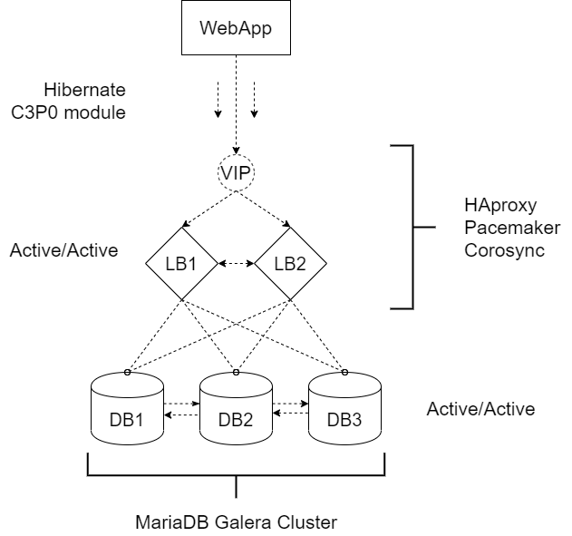

## Some info

This ansible playbook example is created to configure a setup, that provides a web application with high availability access to data, stored in databases. Take a look at the picture shown below to see what is going on here.



So, here is an **active/active** pattern used for both load balancer and databese sections. That means that each node actively running the same kind of service simultaneously and in database clustering case a change made to one is replicated to all..

**Galera** is a database clustering solution that enables you to set up multi-master clusters using synchronous replication. It automatically handles keeping the data on different nodes in sync while allowing you to send read and write queries to any of the nodes in the cluster.

**Corosync** is an open source program that provides cluster membership and messaging capabilities, often referred to as the messaging layer, to client servers. **Pacemaker** is an open source cluster resource manager **(CRM)**, a system that coordinates resources and services that are managed and made highly available by a cluster. In essence, Corosync enables servers to communicate as a cluster, while Pacemaker provides the ability to control how the cluster behaves.

In our case the virtual IP instance **(VIP)** we have is just a simple resource created with pacemaker. Each node has a primary IP address bound to its interface card and also serves this virtual address.

Also it is a good practice to implement **a connetion pooling pattern** for your web applacation to have better experience dealing with setups like this and similar ones.

## Prerequisites
- Each node has to be run under *CentOS 7* and higher.
- Beware that some commands perfomed here have to be executed under *sudo*, so provide Ansible to have that kind of access.
- Good part of this playbook that it can actually configure as many nodes per cluster as you wish (not only the number you see in my       setup), just add other desired IP adresses to *hosts* file.  
  ```
  [galera-nodes]
  node1 1.1.1.1
  node2 1.1.1.2
  node3 1.1.1.3
  ...
  
  [galera-master]
  node1 1.1.1.1
  
  [haproxy-nodes]
  proxy1 1.1.1.4
  proxy2 1.1.1.5
  ...

  [haproxy-master]
  proxy1 1.1.1.4
  ```
- Check whether virtual IP address set in *defaults* is free and fits your subnet. 
